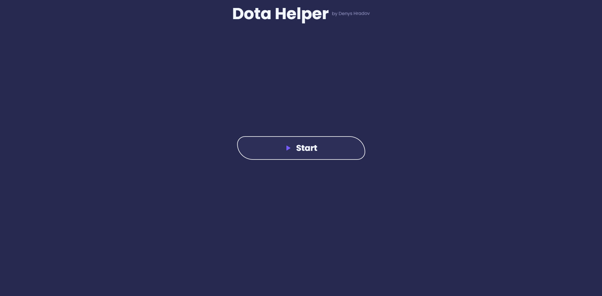
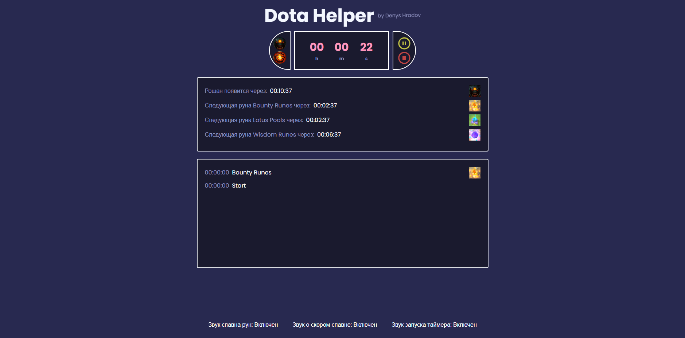

<a name="beginning"></a>

# Website for help to play in Dota 2

### Hi, I'm Denis, and I developed my own website Dota-helper

### During development I used react

### You can watch [short video review](https://youtu.be/NDOIKeihi0M), or you can read this post




## Brief description of the site
### In fact, the whole point of the site is time control. During the game, you need to control different game moments: the spawn of the gold rune, the rune of wisdom, the lotus. And also the spawn of Roshan and the time until the end of the Aegis. By starting the timer at the same time as the start of the game, you will see visual timers that will show when this or that rune will appear. To attract attention, clock icons will also be shown (yellow - if the rune will appear soon, red - if it is about to appear). The system with Roshan and Aegis is a little more complicated, this is discussed in more detail in the video (link above). You can also pause / reset the timer. The site also has sound notifications for various events, which can be configured at the bottom of the site
### The site was made on the knee, it took about 5 hours, so it is quite raw

## Run site
### To run the site, you need to install the dependencies, for this you need to run the command
```
npm install
npm run dev
```